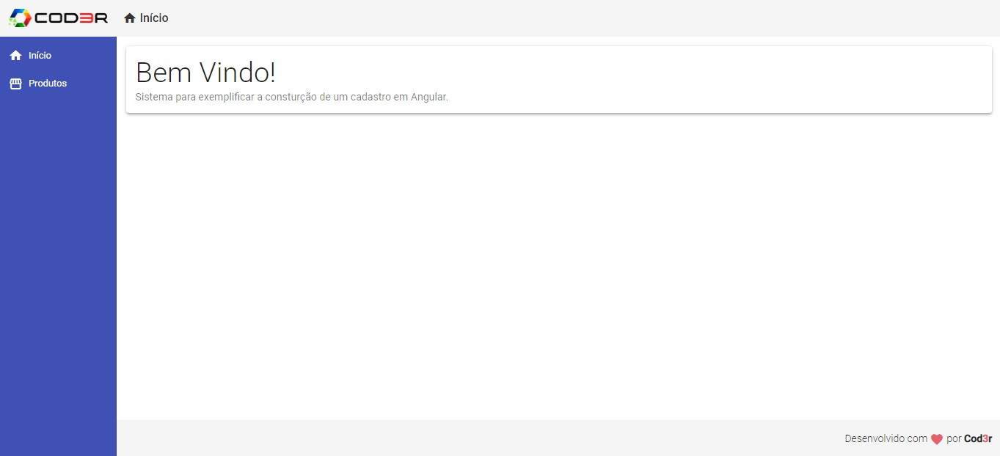
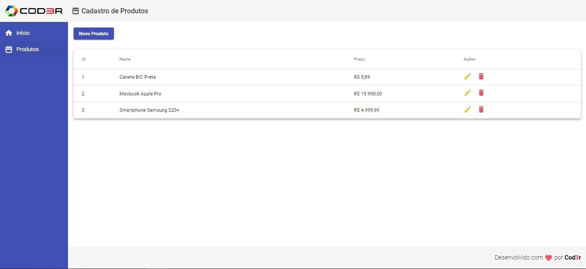
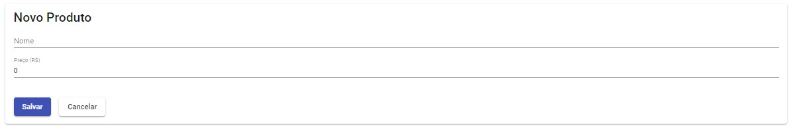
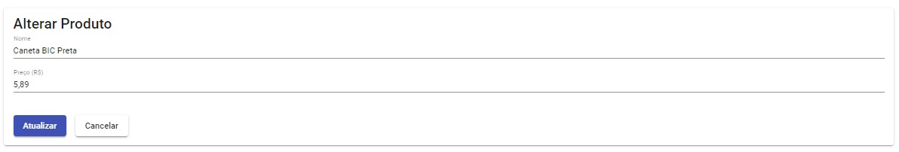
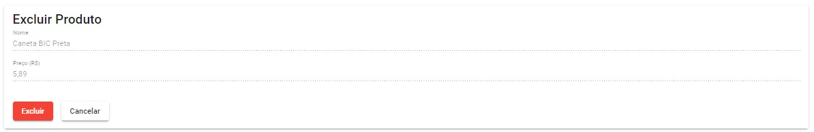

<h1 align="center">
  Angular Front-End CRUD
</h1>

## Índice

- [1. Introdução](#1-introdução)
- [2. Aplicação](#2-aplicação)
- [3. Estrutura e funcionalidades](#3-estrutura-e-funcionalidades)
- [4. Ferramentas Utilizadas](#4-ferramentas-utilizadas)
- [5. Considerações Finais](#5-considerações-finais)
---
 

## 1. Introdução
Aplicação Web desenvolvida para estudos do Framework `Angular`, promovida pela <strong>[Cod3r](https://www.cod3r.com.br/)</strong>.

---
 

## 2. Aplicação
Desenvolvido para estudos de `Angular`, `Typescript` e `Material`, o projeto consiste em desenvolver uma aplicação Web para cadastro, consulta, alteração e exclusão de produtos dentro de uma SPA.

O servidor é estático e gerado através de `Json Server` - explicaremos mais abaixo, caso queira ver a aplicação rodando em seu computador, como instanciar a mesma.

Neste projeto podemos aprofundar um pouco os conhecimentos em `Angular`, onde através de chamadas de API conseguimos interagir com ela, cadastrando, alterando e excluindo produtos.

---
 

## 3. Estrutura e funcionalidades
O projeto consiste em apenas duas páginas desenvolvidas, a Home e a Produtos, e dentro da página produtos é que fica todo o procedimento de interação com a API.

<strong>Página Home</strong>

  

Página simples, apenas de Boas-vindas para quem for visualizar a aplicação.
 
 

<strong>Página Produtos</strong>

  

Inicialmente a página já traz a listagem de produtos que contém cadastrados na API.
Através dessa página você poderá cadastrar um novo produto, clicando no botão <strong>Novo Produto</strong>:

  

Poderá também, alterar um produto já existente, caso necessite, clicando no lápis na página de Produtos:

  

E por fim pode excluir um produto que não esteja mais necessitando, clicando na lixeira:

  

---
 

## 4. Ferramentas Utilizadas

As seguintes ferramentas foram usadas na construção do projeto:

- [x] Angular
- [x] TypeScript
- [x] CSS
- [x] Json Server
- [x] Material-ui

---
 

## 5. Considerações Finais
Desejar ver a aplicação rodando em seu computador, para isso você precisa:
- [x] Dar um Fork nesse repositório;
- [x] Faça um clone do mesmo;

<strong>Back-End</strong>
- [x] `npm install` para instalar todas as dependências;
- [x] `npm start` para iniciar o servidor back-end;

<strong>Front-End</strong>
- [x] `npm install` para instalar todas as dependências;
- [x] `npm start` para iniciar;

<strong>Pronto, agora é só codar!</strong>

Obrigada ao professor <strong>Leonardo Leitão</strong> por esse curso!

---

  <a href="https://github.com/kauanaagostini"> <b>Kauana Maria Agostini</b></a>

